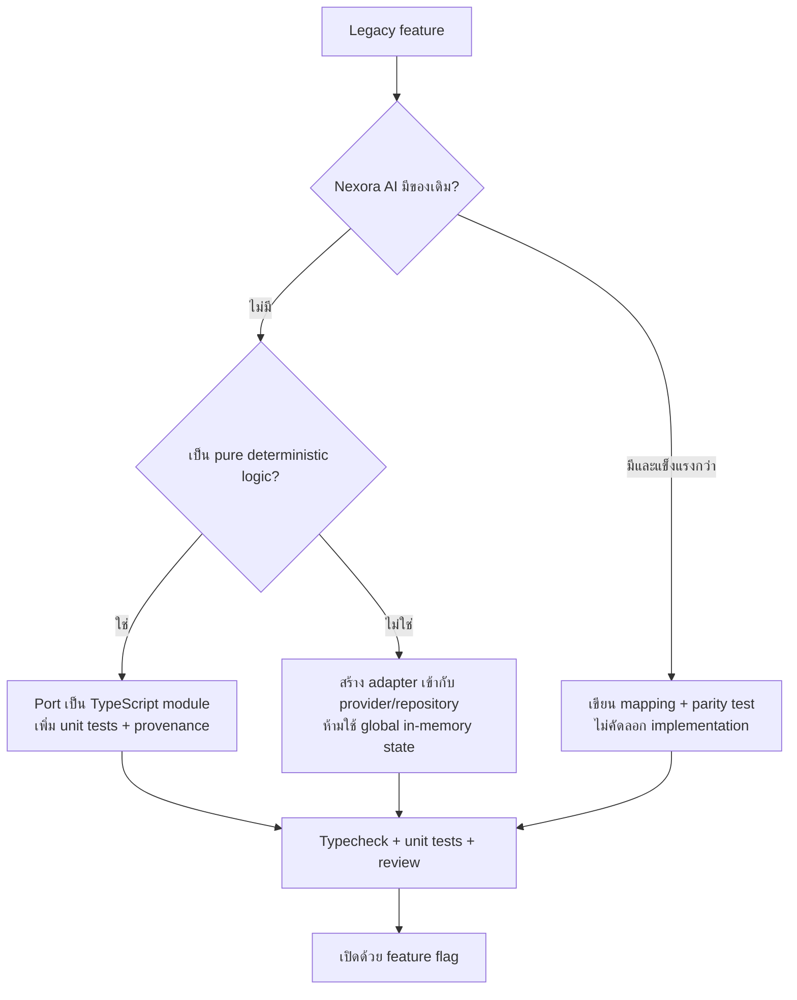

# Nexora AI Migration Pack

ชุดนี้เตรียม source และเอกสารของ `option-tool-invest-bigdata-main` เพื่อใช้เป็น reference ในการพัฒนา `Nexora AI` โดยไม่คัดลอก secret, local environment หรือ generated dependency

## สถานะ

- วิเคราะห์ source ครบ 8 Python modules, 21 API/WebSocket routes และ frontend flow
- เทียบกับโครงสร้าง Nexora AI แล้ว
- สร้าง source manifest พร้อม SHA-256
- ชุด reference พร้อมคัดลอกไป `Nexora AI/docs/migrations/option-tool-invest-bigdata`
- ยังไม่เปิด feature ใหม่ใน runtime ของ Nexora AI โดยอัตโนมัติ เพราะหลายส่วนมี implementation ที่ใหม่กว่าอยู่แล้วและต้องไม่ทับระบบ production

## สิ่งที่ควรย้าย

| ความสามารถเดิม | ปลายทางใน Nexora AI | วิธีใช้ |
|---|---|---|
| Ticker search | `src/lib/instruments/*`, `app/api/market/search/route.ts` | ใช้ของ Nexora AI |
| Quote/session/chart/WebSocket | `src/lib/market-data/*`, `services/market-gateway/*` | ใช้ gateway/provider abstraction เดิม |
| Watchlist | `src/lib/watchlist/*`, `app/watchlist/actions.ts` | ใช้ Supabase/RLS เดิม |
| Portfolio/options positions | `src/lib/portfolio/*` | ใช้ repository และ validation เดิม |
| Fair value | `src/lib/analytics/valuation/*` | ใช้ engine ของ Nexora AI |
| Technical indicators | `src/lib/analytics/technical/*` | ใช้ implementation ที่มี provenance/validation |
| Support/resistance | `src/lib/analytics/support-resistance/*` | ใช้ของ Nexora AI |
| Option pricing + Greeks | `src/lib/options-simulator/pricing.ts` | เทียบผลกับ Python reference; ไม่คัดลอกซ้ำ |
| Portfolio Greeks | `src/lib/options-simulator/portfolio.ts` | ใช้ aggregate Greeks ที่มีอยู่ |
| What-if / Monte Carlo | `src/lib/options-simulator/*`, worker | ใช้ของ Nexora AI ซึ่งรองรับ multi-leg และ audit มากกว่า |
| IV/option analytics | `src/lib/market-data/options/analytics.ts` | ใช้ robust near-ATM IV และ OI concentration |
| Gauges | ยังไม่มีโมดูลตรงตัว | port เฉพาะสูตรที่ผ่าน review เป็น module ใหม่ |
| Weighted prediction | ยังไม่มีโมดูลตรงตัว | ใช้เป็น reference เท่านั้นจนมี calibration/backtest |
| Notification | `src/lib/push/*`, alerts/cron | ใช้ Web Push/notification เดิม ไม่ฝัง token |
| Cache | `src/lib/shared-request-cache.ts` และ gateway cache | ใช้ cache ของ Nexora AI |

## Migration decision graph

## ลำดับพัฒนาที่แนะนำ

1. เก็บ Python และ `index.html` เป็น read-only reference พร้อม checksum
2. สร้าง parity fixtures สำหรับ Black-Scholes, Greeks, IV percentile, gauges และ weighted prediction
3. ใช้ market-data contracts ของ Nexora AI เป็น input; ห้ามเรียก yfinance ตรงจาก feature module
4. Port เฉพาะ gauges ที่มีข้อมูลจริง โดยค่า unavailable ต้องเป็น `null` พร้อมเหตุผล
5. เรียก weighted prediction ว่า rule-based directional model และเพิ่ม calibration/backtest ก่อนแสดงเป็น probability
6. เชื่อม UI ใหม่เข้ากับ stock detail หรือ options simulator หลัง API contract ผ่าน test
7. เปิด feature flag เฉพาะเมื่อ lint, typecheck, tests และ data-provenance review ผ่าน

## สิ่งที่ไม่คัดลอก

- `.env*`, API keys, access tokens หรือ machine-local configuration
- `node_modules`, `.next`, Python cache หรือ build output
- in-memory watchlist/positions จาก process เดิม เพราะไม่มีข้อมูล persistent อยู่จริง
- fallback ราคาหุ้น `100.0`, score `50` หรือค่า delta `0.5` ในฐานะข้อมูลจริง
- debug endpoint ที่เปิด traceback/raw provider detail ใน production

## Acceptance criteria

- สูตรเดียวกันให้ผลตรงกับ reference fixture ภายใน tolerance ที่กำหนด
- ทุก market-derived result มี provider, timestamp, freshness และ warning
- missing data ไม่ถูกแทนด้วยเลขที่ดูเหมือนข้อมูลจริง
- user data ผ่าน Supabase repository/RLS และไม่เก็บใน global variable
- feature ใหม่ไม่แก้หรือทับ market gateway, watchlist, portfolio และ simulator ที่มีอยู่โดยไม่จำเป็น
- ไม่มี secret ใน Git history หรือ client bundle

## ไฟล์ประกอบ

- `docs/SYSTEM_FLOW.md` — system/sequence/data-flow diagrams และ API inventory
- `feature-map.json` — machine-readable migration mapping
- `SOURCE_MANIFEST.sha256` — checksum ของ source ต้นทาง
- `legacy-source/` — snapshot แบบ read-only ที่จะคัดลอกจาก repository ต้นทาง

หมายเหตุด้านสิทธิ์: repository ต้นทางไม่มี `LICENSE` file ในระดับ root ควรยืนยัน ownership/สิทธิ์ในการนำไปแจกจ่ายนอกสองโปรเจกต์นี้ก่อน
