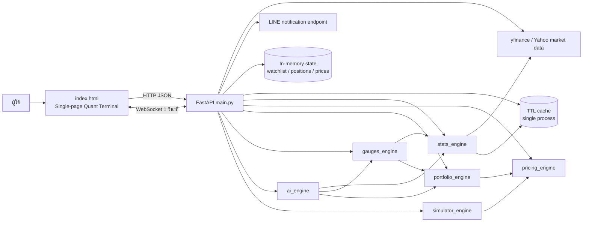
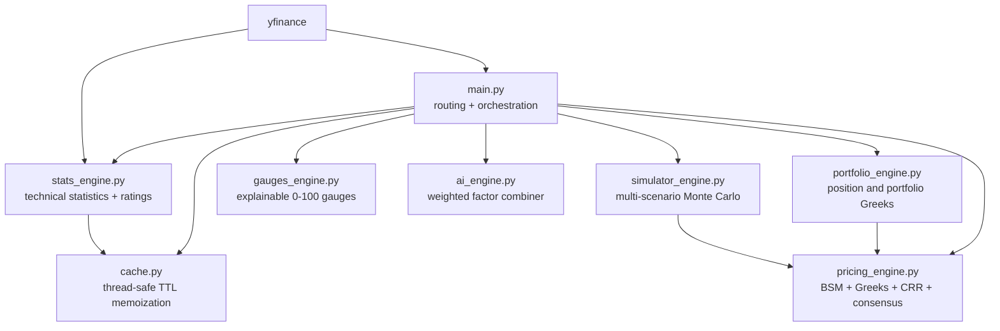
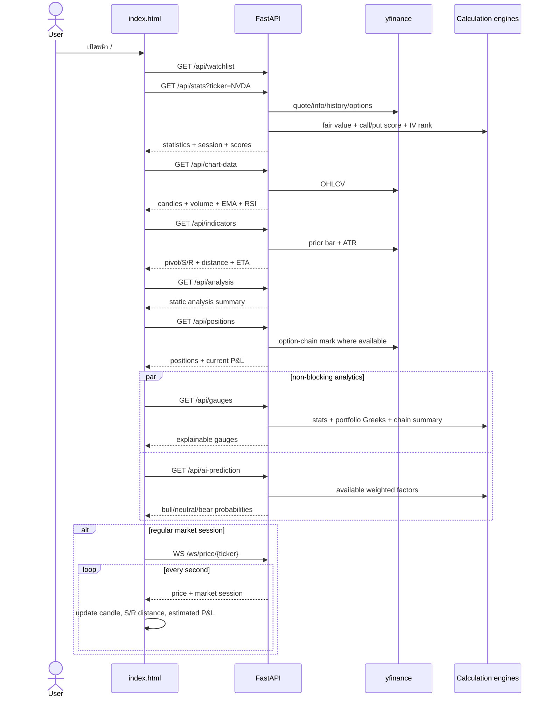
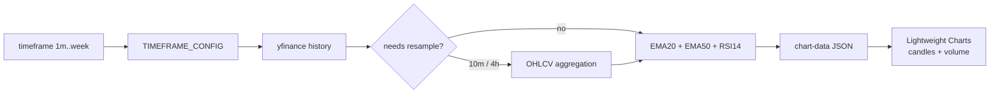
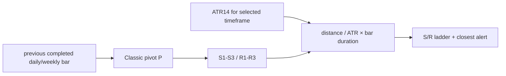
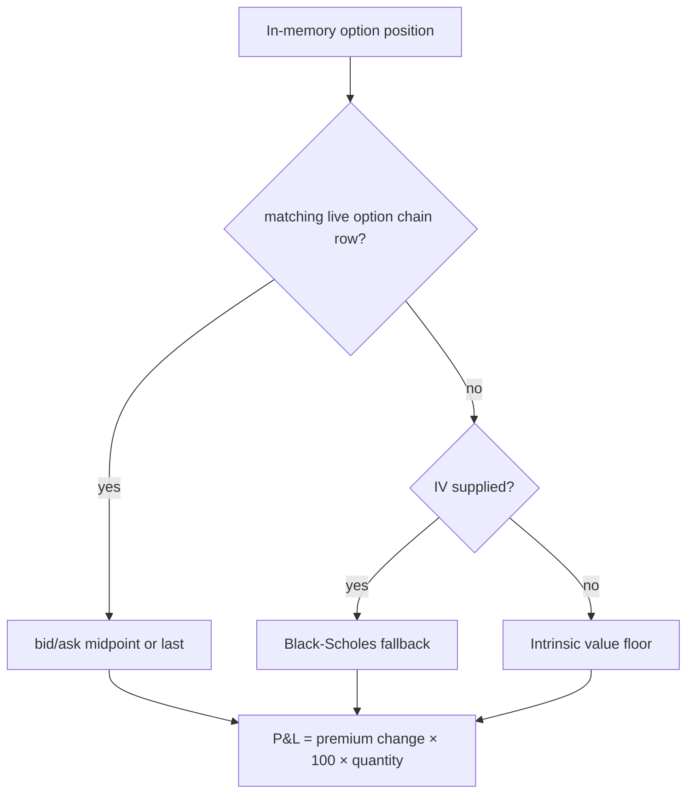
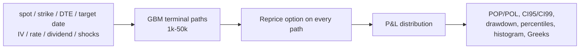

# Option Tool Invest Big Data — System Flow

เอกสารนี้เป็นแผนที่การทำงานของโค้ด ณ วันที่ 2026-07-24 ครอบคลุม frontend, API, data source, state และ calculation engines ทั้งหมดใน repository นี้

## 1. ภาพรวมระบบ

## 2. Dependency graph ภายใน backend

โมดูลคำนวณหลัก:

- `pricing_engine.py`: Black-Scholes-Merton, Delta/Gamma/Theta/Vega/Rho, CRR binomial tree และ weighted price consensus
- `simulator_engine.py`: GBM Monte Carlo แบบ antithetic variates, shock ของ IV/rate/dividend, confidence interval และ histogram
- `portfolio_engine.py`: dollarized Greeks ต่อ position และรวมทั้ง portfolio
- `stats_engine.py`: RSI, MACD, ADX, EMA/SMA, ATR, Bollinger Bands, relative volume, beta เทียบ SPY และ rating 0-100
- `gauges_engine.py`: bullish/bearish, momentum/trend, IV rank/percentile, Greek risk, flow proxy และ confidence
- `ai_engine.py`: rule-based weighted factor combiner ไม่ใช่ trained ML model
- `cache.py`: in-process TTL cache; ไม่แชร์ข้อมูลข้าม worker/instance

## 3. ลำดับตอนเปิดหน้า Dashboard

## 4. Feature flows

### Market data and chart

### Support / resistance

### Position valuation

### Advanced simulator

## 5. API inventory

| Method | Path | หน้าที่ | State / external dependency |
|---|---|---|---|
| GET | `/` | ส่ง `index.html` | local file |
| GET | `/api/tickers` | ค้นหา ticker จากรายการ 6 ตัวในโค้ด | static |
| GET | `/api/watchlist` | อ่าน watchlist | in-memory |
| POST | `/api/watchlist` | เพิ่ม ticker | in-memory |
| DELETE | `/api/watchlist/{ticker}` | ลบ ticker | in-memory |
| GET | `/api/stats` | quote/session/fair value/IV/call-put score | yfinance + cache |
| GET | `/api/indicators` | pivot, S/R, ATR และ ETA | yfinance + cache |
| GET | `/api/chart-data` | OHLCV, EMA20/50, RSI | yfinance |
| GET | `/api/analysis` | ข้อความ analysis แบบคงที่ | static |
| GET | `/api/positions` | mark option และคำนวณ P&L | in-memory + yfinance |
| POST | `/api/positions` | เปิด position จำลอง | in-memory + notification |
| DELETE | `/api/positions/{id}` | ปิด position จำลอง | in-memory + notification |
| WS | `/ws/price/{ticker}` | stream price/session ทุกวินาที | yfinance + in-memory |
| POST | `/api/simulate` | point-in-time what-if ด้วย Black-Scholes | calculation only |
| GET | `/api/gauges` | 18 explainable gauges + confidence | stats/portfolio/chain |
| GET | `/api/ai-prediction` | weighted bull/neutral/bear probabilities | stats/gauges/portfolio |
| POST | `/api/simulate-advanced` | multi-scenario Monte Carlo | simulator engine |
| GET | `/api/portfolio/greeks` | aggregate portfolio Greeks | portfolio/pricing |
| GET | `/api/debug/yfinance` | diagnostic raw provider result | yfinance |
| GET | `/api/cache/stats` | จำนวน cache entries | in-memory cache |
| DELETE | `/api/cache` | ล้าง cache | in-memory cache |

## 6. State และ data lifecycle

| Data | ที่เก็บ | อายุข้อมูล | ผลเมื่อ restart |
|---|---|---|---|
| Watchlist | Python list | จน process หยุด | หายและกลับค่า default |
| Positions | Python list | จน process หยุด | หายทั้งหมด |
| Last prices | Python dict | จน process หยุด | หายทั้งหมด |
| Cached market results | TTL dict | 5-300 วินาที | หายทั้งหมด |
| User/session/auth | ไม่มี | ไม่มี | ไม่มีระบบรองรับ |
| Historical/option data | ดึงจาก yfinance | ตาม TTL ของแต่ละ function | ดึงใหม่ |

Repository นี้ไม่มี database file หรือ persistent user data ให้ย้าย ข้อมูลที่คัดลอกไปพัฒนาได้จึงเป็น source code, formulas, API contracts และ UI behavior เท่านั้น

## 7. จุดเสี่ยงก่อนนำไป production

- `LINE_ACCESS_TOKEN` ถูกกำหนดใน source code; ระบบใหม่ต้องใช้ server-side environment secret และ notification adapter
- endpoint ส่วนใหญ่ไม่มี authentication, authorization, rate limiting หรือ schema validation ของ query ticker/timeframe
- watchlist/positions/cache เป็น single-process memory ไม่รองรับหลาย instance
- `main.py` มี Black-Scholes ซ้ำกับ `pricing_engine.py` และให้ผล/รูปแบบ return คนละแบบ
- `index.html` คำนวณ live P&L ด้วย delta หรือ delta fallback `0.5`; เป็นค่าประมาณที่ต่างจาก backend valuation
- `/api/analysis` เป็นข้อความคงที่ แม้ชื่อ UI จะระบุ live analysis
- `calculate_iv_rank()` บางกรณีคืนค่า IV × 100 ซึ่งไม่ใช่ historical IV rank
- `ai_engine.py` เป็น explainable rule engine ไม่ใช่ AI/ML ที่ผ่านการ train หรือ backtest
- provider exceptions หลายจุดถูกกลืนและ fallback เป็น `100.0`, `50` หรือ intrinsic value จึงต้องส่ง provenance/warning ในระบบใหม่
- ตัวอักษรไทยบางส่วนใน source แสดงอาการ encoding เสีย ควร normalize เป็น UTF-8 ระหว่าง port

## 8. ขอบเขตการนำกลับมาใช้

รายละเอียดการเทียบกับ Nexora AI และลำดับการย้ายอยู่ใน `migration/nexora-ai/README.md` ของ repository ต้นทาง หรือ `README.md` ในโฟลเดอร์ migration pack ที่คัดลอกไปยังปลายทาง
